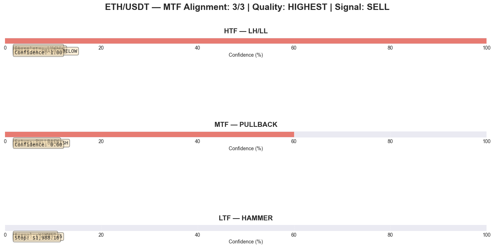
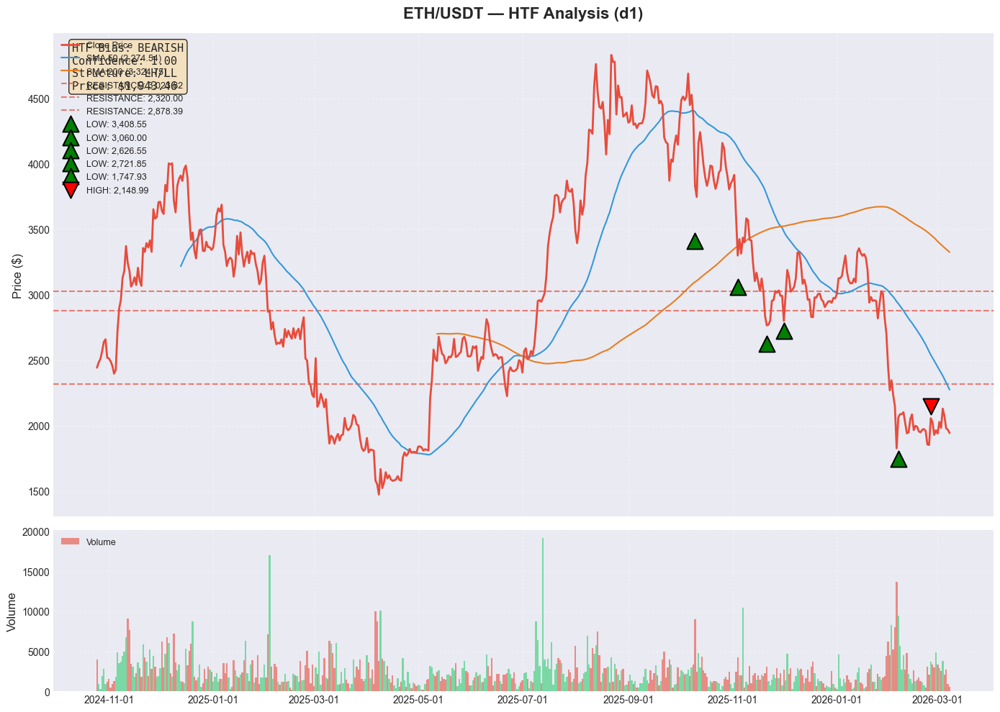
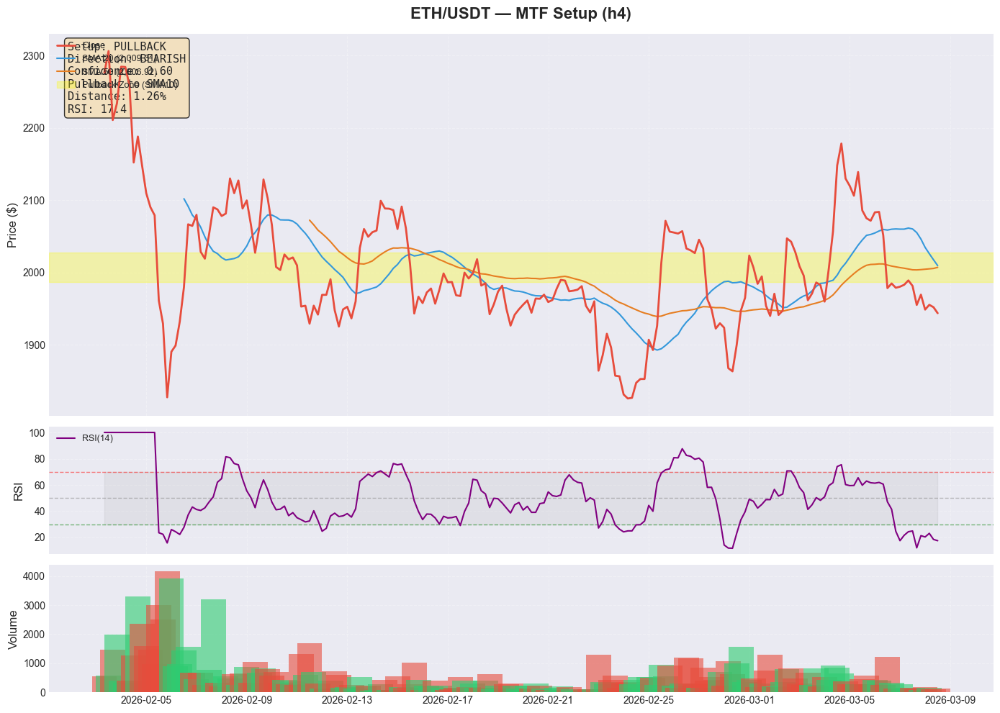
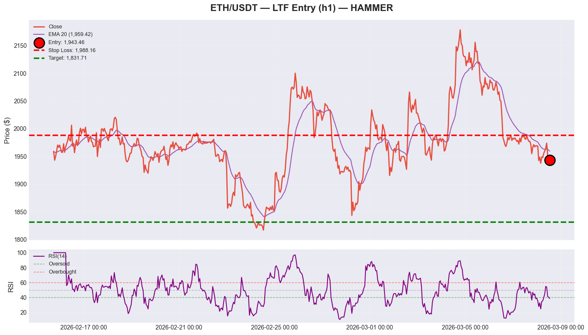

# MTF Analysis Report: ETH/USDT (Intraday Trading)

**Generated:** 2026-03-08 13:53:36 UTC  
**Trading Style:** INTRADAY  
**Analysis Type:** Multi-Timeframe Framework (Real-Time Data)  
**Data Source:** CCXT/Kraken (Crypto), Twelve Data (Metals/Forex)

---

## ⚠️ Disclaimer

This report is generated for **educational and informational purposes only**. 
It does not constitute financial advice. Always do your own research before trading.

Past performance does not guarantee future results. Trading involves substantial risk.

---

## Executive Summary

| Metric | Value |
|--------|-------|
| **Pair** | ETH/USDT |
| **Overall Signal** | SELL |
| **Alignment Score** | 3/3 (HIGHEST) |
| **HTF Close** | $1,943.46 |
| **MTF Close** | $1,943.46 |
| **LTF Close** | $1,943.46 |
| **Entry Price** | $1,943.46 |
| **Stop Loss** | $1,988.16 |
| **Target Price** | $1,831.71 |
| **R:R Ratio** | 2.50:1 |
| **Confidence** | High |


## 📊 Data Quality Check

**Overall Status:** ✅ PASS

| Timeframe | Candles | Required | Status | Freshness |
|-----------|---------|----------|--------|-----------|
| **HTF** (d1) | 500 | 200 | ✅ PASS | 13.9h old |
| **MTF** (h4) | 200 | 50 | ✅ PASS | 1.9h old |
| **LTF** (h1) | 500 | 50 | ✅ PASS | 0.9h old |

**Assessment:** ✅ All timeframes have sufficient, fresh data


## 📊 Multi-Timeframe Alignment



*Figure 1: Timeframe alignment overview. Green = Bullish, Red = Bearish, Gray = Neutral.*

---

## Timeframe Configuration (Intraday)

| Layer | Timeframe | Role | Indicators |
|-------|-----------|------|------------|
| **HTF** | d1 | Directional Bias | 50 SMA, 200 SMA, Price Structure |
| **MTF** | h4 | Setup Identification | 20 SMA, 50 SMA, RSI(14) |
| **LTF** | h1 | Entry Timing | 20 EMA, Candlestick Patterns, RSI(14) |

---

## 1. Higher Timeframe (d1) — Directional Bias

### 1.1 Price Structure

**Structure Type:** LH/LL

**Recent Swing Points:**
| Type | Price | Strength |
|------|-------|----------|
| LOW | $3,408.55 | 1.00 |
| LOW | $3,060.00 | 1.00 |
| LOW | $2,626.55 | 0.92 |
| LOW | $2,721.85 | 0.86 |
| LOW | $1,747.93 | 1.00 |
| HIGH | $2,148.99 | 1.00 |

### 1.2 Moving Averages

| MA | Value | Price Position | Slope |
|----|-------|----------------|-------|
| 50 SMA | $1,943.46 | BELOW | DOWN |
| 200 SMA | — | BELOW | — |

### 1.3 Key Levels

| Type | Price | Strength |
|------|-------|----------|
| RESISTANCE | $3,023.82 | WEAK |
| RESISTANCE | $2,320.00 | WEAK |
| RESISTANCE | $2,878.39 | WEAK |
| RESISTANCE | $3,422.46 | STRONG |
| RESISTANCE | $2,120.34 | STRONG |

### 1.4 HTF Bias Result

```
HTF (d1) Bias: BEARISH
Confidence: 1.00
Price Structure: LH/LL
```




*Figure 2: HTF bias analysis showing price structure, SMAs, and key levels.*

---

## 2. Middle Timeframe (h4) — Setup Identification

### 2.1 Setup Details

**Setup Type:** PULLBACK  
**Direction:** BEARISH  
**Confidence:** 0.60

**Pullback Details:**
- Approaching SMA: 10
- Distance to SMA: 1.26%
- RSI Level: 17.4

### 2.2 MTF Setup Result

```
MTF (h4) Setup: PULLBACK
Confidence: 0.60
Direction: BEARISH
```




*Figure 3: MTF setup detection showing pullback zones and RSI.*

---

## 3. Lower Timeframe (h1) — Entry Signal

### 3.1 Entry Details

**Signal Type:** HAMMER  
**Direction:** BEARISH  
**EMA20 Reclaim:** Yes ✓  
**RSI Turn:** NONE

### 3.2 Trade Parameters

| Parameter | Value |
|-----------|-------|
| Entry Price | $1,943.46 |
| Stop Loss | $1,988.16 |
| Risk | $-44.70 (-2.30%) |
| Target | $1,831.71 |
| Reward | $-111.75 (-5.75%) |
| R:R Ratio | 2.50:1 |

### 3.3 LTF Entry Result

```
LTF (h1) Entry: HAMMER
Entry Price: $1,943.46
Stop Loss: $1,988.16
```




*Figure 4: LTF entry signal showing entry point, stop loss, and target.*

---

## 4. Alignment Scoring

### 4.1 Timeframe Alignment

| Timeframe | Direction | Confidence | Aligned? |
|-----------|-----------|------------|----------|
| HTF (d1) | BEARISH | 1.00 | ✅ |
| MTF (h4) | BEARISH | 0.60 | ✅ |
| LTF (h1) | BEARISH | — | ✅ |

**Alignment Score: 3/3**

### 4.2 Quality Assessment

```
Alignment Score: 3/3
Quality: HIGHEST
Recommendation: SELL
```

### 4.3 Patterns Detected

- HTF: BEARISH (LH/LL)
- MTF: Pullback to SMA10
- LTF: HAMMER entry

---

## 5. Final Trade Setup

```
╔═══════════════════════════════════════════════════════════╗
║         ETH/USDT — MTF TRADE SETUP (INTRADAY)            ║
╠═══════════════════════════════════════════════════════════╣
║  Signal: SELL                                                  ║
║  Quality: HIGHEST         (3/3 aligned)                         ║
║  Confidence: High                                          ║
╠═══════════════════════════════════════════════════════════╣
║  ENTRY:           $                                  1,943.46║
║  STOP LOSS:       $                                  1,988.16║
║  TARGET:          $                                  1,831.71║
╠═══════════════════════════════════════════════════════════╣
║  RISK:            $                                    -44.70║
║  REWARD:          $                                   -111.75║
║  R:R RATIO:                                             2.50:1║
╚═══════════════════════════════════════════════════════════╝
```

---

## 6. Risk Warning

**This analysis is based on historical data and technical indicators. It does not:**

- Guarantee future performance
- Account for fundamental news or events
- Replace proper risk management
- Constitute financial advice

**Always:**
- Use proper position sizing (risk 1-2% per trade)
- Set stop losses and stick to them
- Do your own research
- Never trade more than you can afford to lose

---

## 7. Monitoring Checklist

### Before Entry:
- [ ] All 3 timeframes aligned?
- [ ] R:R ratio ≥ 2.0?
- [ ] No major news events scheduled?
- [ ] Position size calculated?

### After Entry:
- [ ] Stop loss set?
- [ ] Target levels defined?
- [ ] Monitoring plan in place?

---

**Report Generated by TA-DSS MTF Scanner**  
*Multi-Timeframe Analysis Framework v1.0*  
**Data is real-time. Analysis is automated. Trade at your own risk.**
