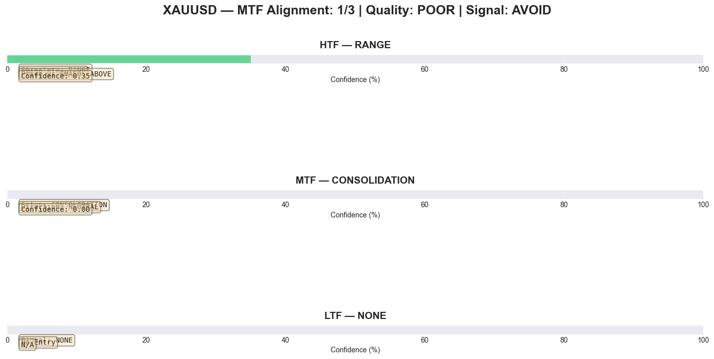
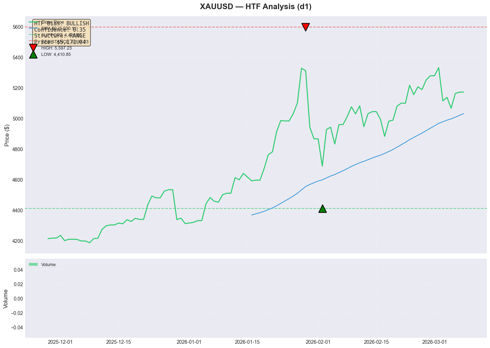
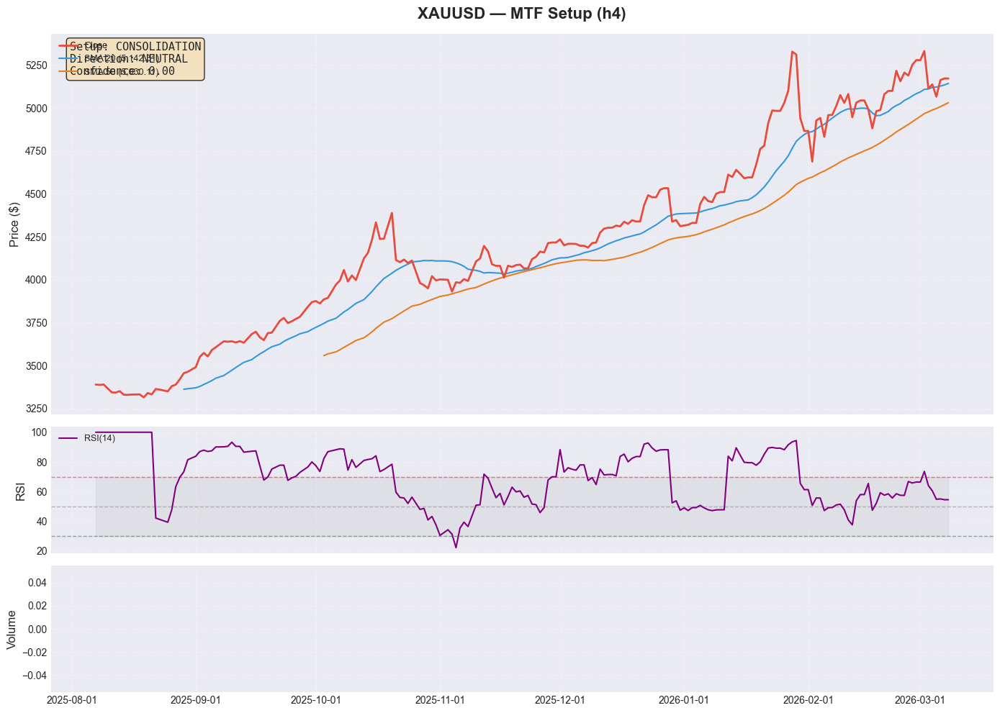

# MTF Analysis Report: XAUUSD (Intraday Trading)

**Generated:** 2026-03-08 12:58:48 UTC  
**Trading Style:** INTRADAY  
**Analysis Type:** Multi-Timeframe Framework (Real-Time Data)  
**Data Source:** CCXT/Kraken (Crypto), Twelve Data (Metals/Forex)

---

## ⚠️ Disclaimer

This report is generated for **educational and informational purposes only**. 
It does not constitute financial advice. Always do your own research before trading.

Past performance does not guarantee future results. Trading involves substantial risk.

---

## Executive Summary

| Metric | Value |
|--------|-------|
| **Pair** | XAUUSD |
| **Overall Signal** | AVOID |
| **Alignment Score** | 1/3 (POOR) |
| **HTF Close** | $5,171.04 |
| **MTF Close** | $5,171.05 |
| **LTF Close** | $5,171.04 |
| **Confidence** | Pending |


## 📊 Data Quality Check

**Overall Status:** ⚠️ WARNING

| Timeframe | Candles | Required | Status | Freshness |
|-----------|---------|----------|--------|-----------|
| **HTF** (d1) | 101 | 200 | ⚠️ WARNING | 13.0h old |
| **MTF** (h4) | 200 | 50 | ⚠️ WARNING | 13.0h old |
| **LTF** (h1) | 200 | 50 | ⚠️ WARNING | 13.0h old |

**Assessment:** ⚠️ HTF needs 99 more candles


> [!WARNING]
> **Data Quality Warning:** ⚠️ HTF needs 99 more candles
> 
**Recommendations:**
1. Fetch 99 more HTF candles for full SMA 200 analysis
2. Refresh MTF data (currently 13.0h old)
3. Refresh LTF data (currently 13.0h old)


> [!IMPORTANT]
> **MTF Analysis Not Recommended:** Insufficient data for reliable MTF analysis.
> The signals below may be unreliable due to data quality issues.
> 

## 📊 Multi-Timeframe Alignment



*Figure 1: Timeframe alignment overview. Green = Bullish, Red = Bearish, Gray = Neutral.*

---

## Timeframe Configuration (Intraday)

| Layer | Timeframe | Role | Indicators |
|-------|-----------|------|------------|
| **HTF** | d1 | Directional Bias | 50 SMA, 200 SMA, Price Structure |
| **MTF** | h4 | Setup Identification | 20 SMA, 50 SMA, RSI(14) |
| **LTF** | h1 | Entry Timing | 20 EMA, Candlestick Patterns, RSI(14) |

---

## 1. Higher Timeframe (d1) — Directional Bias

### 1.1 Price Structure

**Structure Type:** RANGE

**Recent Swing Points:**
| Type | Price | Strength |
|------|-------|----------|
| HIGH | $5,597.23 | 0.74 |
| LOW | $4,410.85 | 1.00 |

### 1.2 Moving Averages

| MA | Value | Price Position | Slope |
|----|-------|----------------|-------|
| 50 SMA | $5,171.04 | ABOVE | UP |
| 200 SMA | — | AT | — |

### 1.3 Key Levels

| Type | Price | Strength |
|------|-------|----------|
| SUPPORT | $4,410.85 | STRONG |
| RESISTANCE | $5,597.23 | MEDIUM |

### 1.4 HTF Bias Result

```
HTF (d1) Bias: BULLISH
Confidence: 0.35
Price Structure: RANGE
```




*Figure 2: HTF bias analysis showing price structure, SMAs, and key levels.*

---

## 2. Middle Timeframe (h4) — Setup Identification

### 2.1 Setup Details

**Setup Type:** CONSOLIDATION  
**Direction:** NEUTRAL  
**Confidence:** 0.00


### 2.2 MTF Setup Result

```
MTF (h4) Setup: CONSOLIDATION
Confidence: 0.00
Direction: NEUTRAL
```




*Figure 3: MTF setup detection showing pullback zones and RSI.*

---

## 3. Lower Timeframe (h1) — Entry Signal

### 3.1 Entry Details

**Signal Type:** NONE  
**Direction:** NEUTRAL  
**EMA20 Reclaim:** No ✗  
**RSI Turn:** NONE


### 3.3 LTF Entry Result

```
LTF (h1) Entry: NONE
Entry Price: $0.00
Stop Loss: $0.00
```


## 4. Alignment Scoring

### 4.1 Timeframe Alignment

| Timeframe | Direction | Confidence | Aligned? |
|-----------|-----------|------------|----------|
| HTF (d1) | BULLISH | 0.35 | ✅ |
| MTF (h4) | NEUTRAL | 0.00 | ❌ |
| LTF (h1) | NEUTRAL | — | ❌ |

**Alignment Score: 1/3**

### 4.2 Quality Assessment

```
Alignment Score: 1/3
Quality: POOR
Recommendation: AVOID
```

### 4.3 Patterns Detected

- HTF: BULLISH (RANGE)
- MTF: CONSOLIDATION
- LTF: Not analyzed

---

## 5. Final Trade Setup

```
╔═══════════════════════════════════════════════════════════╗
║         XAUUSD — MTF TRADE SETUP (INTRADAY)            ║
╠═══════════════════════════════════════════════════════════╣
║  Signal: AVOID                                                 ║
║  Quality: POOR            (1/3 aligned)                         ║
║  Confidence: Pending                                       ║
╠═══════════════════════════════════════════════════════════╣
╚═══════════════════════════════════════════════════════════╝
```

---

## 6. Risk Warning

**This analysis is based on historical data and technical indicators. It does not:**

- Guarantee future performance
- Account for fundamental news or events
- Replace proper risk management
- Constitute financial advice

**Always:**
- Use proper position sizing (risk 1-2% per trade)
- Set stop losses and stick to them
- Do your own research
- Never trade more than you can afford to lose

---

## 7. Monitoring Checklist

### Before Entry:
- [ ] All 3 timeframes aligned?
- [ ] R:R ratio ≥ 2.0?
- [ ] No major news events scheduled?
- [ ] Position size calculated?

### After Entry:
- [ ] Stop loss set?
- [ ] Target levels defined?
- [ ] Monitoring plan in place?

---

**Report Generated by TA-DSS MTF Scanner**  
*Multi-Timeframe Analysis Framework v1.0*  
**Data is real-time. Analysis is automated. Trade at your own risk.**
